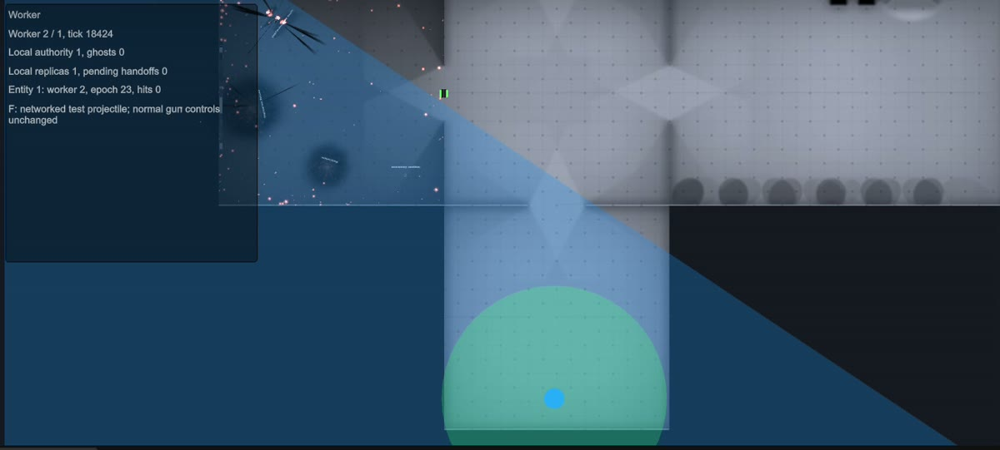

## The current local world

The first Unity server coordinates the world and also simulates its assigned entities. Additional Unity instances join as workers. The local backend partitions X/Z world bounds into Voronoi-like regions and updates the assignment when workers join.

Automatic handoffs follow boundary crossings and backend decisions. Gameplay does not manually choose a worker ID, and highlighted region geometry is **debug information**, not a permission check.

The coordinator stores a lightweight canonical entity directory, including identity, schema, state, and assignment. Its live Unity replicas are a separate collection: local authority, interested ghosts, host-client visibility where applicable, and temporary handoff residency.

`TrackedEntityCount` on the coordinator can therefore exceed `SpawnedCount`. Keeping a directory entry does not grant simulation authority or mean the entity should have an active renderer/collider there.

## Radius-based interest

On an owned player, `NetworkInterestSource` supplies **Radius** and **Exit Padding**. The current development policy operates in horizontal **X/Z distance**, not full 3D distance, camera FOV, or line of sight.

The local backend uses the radius to find candidate authoring regions and then filters individual entities by their distance from the player. Exit padding lets an existing replica remain slightly farther away before removal, reducing edge churn.

The two residency rules are intentionally different:

| Receiver | Current policy |
| --- | --- |
| Authoring worker | Holds its authoritative entities and interested cross-worker ghosts needed by its owned players |
| Client with a registered player interest source | Holds its own entity, entities on its player's authoring worker, and matching cross-worker entities in its radius |
| Client without this radius-interest setup | Uses the local implementation's broader observer path; do not assume spatial filtering |

Thus an entity on the client's current authoring worker is not radius-culled merely because it is far from that player. Cross-worker interest is not “all entities on every overlapping worker,” and worker interest is not the same as client camera visibility.

This is a **local development policy**, not a finalized production AtlasNet query/filter API.

## What happens at a handoff?

At a high level, the local backend prepares the destination, transfers simulation state, commits a new assignment/epoch, and updates residency. The framework routes entity-directed requests to the current authority during that transition.

- `EntityId` remains the same.
- The controlling session normally stays the same.
- `SimulationWorker` changes, and `AuthorityEpoch` advances on commit.
- Authority can be transiently unavailable during preparation; do not assume exactly one Unity copy is writable at every instant.
- Owner-written channels are carried forward separately from server simulation state.
- The old copy can become a ghost or be evicted when it no longer has a residency reason.

Check `HasAuthority` each time you simulate. Keep long-running gameplay state in transferable fields, not worker-specific services or coroutine progress that only exists on the source process.

## WriteHandoffState and ReadHandoffState

Regular snapshots carry replicated variables/component state. These overrides transfer **additional private simulation state between workers**, not presentation state to every observing client.

For example, a server-side lifetime timer must not restart each time an entity changes worker:

```csharp title="TimedEntity.cs"
using AtlasNet;
using UnityEngine;

public sealed class TimedEntity : NetworkBehaviour
{
    [SerializeField] private float lifetime = 5f;
    private float elapsed;

    public override void OnNetworkTick()
    {
        if (!HasAuthority) return;

        elapsed += 1f / NetworkManager.TickRate;

        if (elapsed >= lifetime)
            NetworkObject.Despawn();
    }

    protected override void WriteHandoffState(NetWriter writer)
    {
        writer.Write(elapsed);
    }

    protected override void ReadHandoffState(NetReader reader)
    {
        elapsed = reader.ReadFloat();
    }
}
```

Write and read the same types in the same order. Transfer numeric simulation state such as elapsed time, pending input, cooldowns, and motor velocity. Do not serialize cameras, `GameObject` references, open sockets, coroutines, or worker addresses.

Do not reset restored state in `OnNetworkSpawn`. The destination receives handoff data as part of its network lifecycle; initialization that blindly overwrites it defeats the transfer. Fields with ordinary prefab/default initialization are safer than unconditional timer resets in spawn callbacks.

Use a `NetworkVariable` instead if observers need that state. Use an RPC if it is a one-off event. You do not need these overrides merely to repeat a value already captured by the framework's replicated state.

## Debug views

The optional **LocalDebugView** sample prefab is local-only. Place it in the scene beside the manager, not in the network prefab registry.

- Server/host: top-down orthographic view, highlighted local region, relevant player interest circles, authority/ghost markers. Middle-mouse drag pans; scroll zooms.
- Joined client: **F8** toggles its own interest circle and current authoring worker's boundary without moving its gameplay camera.
- Blue markers represent local authority; amber markers distinguish worker ghosts.



<p className="atlas-caption">A crop from the actual shooter recording, not an Inspector mockup. The highlighted region is debug geometry; the circle represents player interest.</p>

Read the manager and entity runtime Inspector fields together. `IsServer`, `HasAuthority`, and local residency answer different questions. Logs about coordinator routing do not prove that it still simulates an evicted entity.

Debug shapes are requested through optional APIs such as `RequestLocalRegionForDebug` and `SetClientDebugRegionEnabled`. The sample handles them; game logic should not rely on a successful shape query to move or validate an entity.

## Local backend versus future integration

Today, clients and workers use local TCP and the first server relays traffic. The expected production arrangement is a persistent client-to-ingress connection, automatic retargeting to the authoring server, and direct worker-to-worker interest/authoritative packet paths managed by AtlasNet.

That C++ bridge is **not connected yet**. The developer-facing contract is entity/session-directed gameplay, single-writer state, lifecycle notifications, and transferable simulation state. The local coordinator topology is not an API game scripts should depend on.

The deeper [backend contract](https://github.com/dannys0n/AtlasNetUnity/blob/main/Packages/com.atlasnet.unity/Documentation~/AuthorityBackendContract.md) remains a design/reference document. Its production expectations should not be confused with implemented runtime guarantees.
