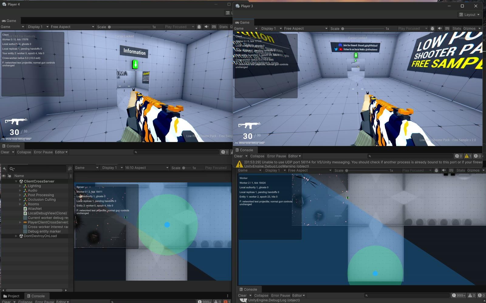

<p className="atlas-eyebrow">UNITY NETWORKING · FIRST-PASS GUIDE</p>

<p className="atlas-lead">Build gameplay with familiar objects, replicated values, and RPCs. Let the framework route those objects to their current simulation worker.</p>

AtlasNet Unity is an experimental Unity Package Manager package. Its current **local backend** lets Unity instances act as clients or workers in one localhost world. It is a development implementation, not the production AtlasNet C++ integration.

<div className="atlas-cards">
  <div className="atlas-card">

### Start with a working scene

[Install the package](./getting-started/installation.md), import the optional sample, then [start a local session](./getting-started/first-session.md).

  </div>
  <div className="atlas-card">

### Understand authority

[Separate ownership from simulation](./concepts/authority.md). An entity keeps its identity even when its authoring worker changes.

  </div>
  <div className="atlas-card">

### Add gameplay

Set up [prefabs and components](./guides/prefabs-components.md), then add [movement](./guides/movement.md), [state](./guides/network-variables.md), and [RPCs](./guides/rpcs.md).

  </div>
  <div className="atlas-card">

### Explore multiple workers

Learn how [interest and handoff](./guides/interest-handoffs.md) affect local replicas without exposing worker addresses to gameplay code.

  </div>
</div>

## A familiar starting point

```csharp
using AtlasNet;
using UnityEngine;

public sealed class ExamplePlayer : NetworkBehaviour
{
    private NetworkVariable<int> score = new(0);

    private void Update()
    {
        if (!IsOwner) return;

        if (Input.GetKeyDown(KeyCode.F))
            AddScoreRpc();
    }

    [Rpc(SendTo.Authority, InvokePermission = RpcInvokePermission.Owner)]
    private void AddScoreRpc()
    {
        // Runs on this entity's current authoritative worker.
        score.Value += 1;
    }
}
```

Attach this behaviour beside a `NetworkObject` on a registered, spawned prefab. `IsOwner` selects the controlling client; `SendTo.Authority` selects the current simulation worker. They are deliberately different concepts.

## See the separate shooter demo

[](https://youtu.be/4-gM8oYjoGM)

<p className="atlas-caption">An actual frame from the separate shooter demonstration. The shooter map and weapons are not bundled with the package sample. Select the image to watch the recording.</p>

## Current scope

These guides describe the `0.1.0` package surface and current local-worker implementation, checked against source for this first pass. The repository demo targets Unity **6000.6.2f1**; `package.json` declares Unity **6000.0**. That declaration is not evidence of testing every Unity 6 release.

Implemented surfaces include prefab registration, spawn/despawn, client-written movement/aim channels, server simulation, replicated variables, attributed RPCs, basic Rigidbody replication, Animator synchronization, radius-based worker interest, and experimental local authority handoff.

Prediction, reconciliation, lag compensation, production reconnect/recovery, persistence, distributed physics, and the native AtlasNet bridge are **not implemented guarantees**. Read [limitations](./troubleshooting.md#what-this-prototype-does-not-promise) before using this as production networking.
